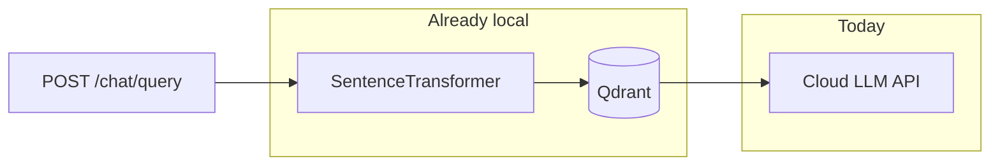
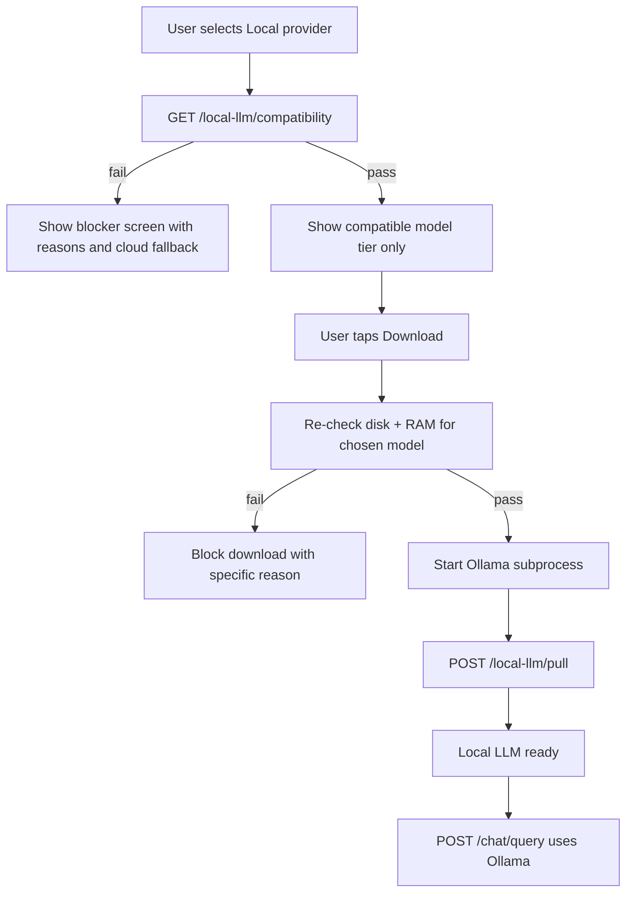

# Local LLM via Managed Ollama

> Implementation plan for adding offline, on-device chat via Ollama to Local Company RAG.  
> Last updated: June 2026

## Overview

Add a managed Ollama-based local LLM provider so non-technical users can chat over their indexed documents without API keys, with hardware-aware model recommendations, one-click downloads, and automatic lifecycle management alongside the existing Python backend.

## Implementation checklist

- [ ] **compat-gate** — Add `local_llm/compatibility.py` + `GET /local-llm/compatibility` (runs before any Ollama start, pull, or local chat)
- [ ] **ollama-lifecycle** — Add `ollama_manager.py`: lazy start/stop Ollama subprocess only after compatibility passes
- [ ] **llm-provider-ollama** — Extend `llm_providers.py` + `app.py` `generate_answer` for Ollama chat API (no API key)
- [ ] **hardware-api** — Add `local_llm/hardware.py` + REST endpoints for model catalog, pull progress, re-check compatibility
- [ ] **settings-ollama** — Update `settings_store.py` to support `ollama` provider without key requirements
- [ ] **flutter-intelligence** — Intelligence UI: Local provider, compatibility blocker, model download flow, privacy dialog update
- [ ] **packaging-ollama** — Bundle Ollama Windows binary in packaging scripts; document minimum system requirements

---

## Current state

Chat today is **cloud-only** through `llm_providers.py`: OpenAI-compatible and Anthropic APIs, selected in **Intelligence** and stored in `settings_store.py`. RAG retrieval (embeddings + Qdrant) is already local via `sentence-transformers` in `app.py`; only the **answer generation** step leaves the machine.

**Goal:** add a **Local (Ollama)** path so question + retrieved snippets never leave the PC.

---

## Popular downloadable models (2025–2026)

These are the models most teams use for **local RAG** on consumer hardware. All are available through Ollama (`ollama pull <name>`) as quantized GGUF builds.

| Tier | Model (Ollama tag) | Disk | RAM needed | Best for |
|------|-------------------|------|------------|----------|
| Light | `llama3.2:3b` | ~2 GB | 8 GB system RAM | Laptops, CPU-only, fastest download |
| Light | `phi3:mini` | ~2.3 GB | 8 GB RAM | Short answers, lower quality |
| Balanced | `qwen2.5:7b` | ~4.7 GB | 16 GB RAM or 8 GB VRAM | **Recommended default** for RAG quality |
| Balanced | `mistral:7b` | ~4.1 GB | 16 GB RAM or 8 GB VRAM | Strong general reasoning |
| Balanced | `gemma2:9b` | ~5.5 GB | 16 GB RAM or 10 GB VRAM | Good instruction following |
| Quality | `llama3.1:8b` | ~4.7 GB | 16 GB RAM or 8 GB VRAM | Better answers, slower on CPU |
| Quality | `qwen2.5:14b` | ~9 GB | 32 GB RAM or 12+ GB VRAM | Office workstations only |

**Practical recommendation:** ship a **curated short list** (3–4 models), not the full Ollama library:

- Default suggestion: `qwen2.5:7b` (best quality/speed tradeoff for document Q&A)
- Fallback for weak machines: `llama3.2:3b`
- Optional “high quality”: `llama3.1:8b` (only if hardware check passes)

Avoid bundling models in the installer — download on demand (like embeddings already cache under `paths.get_models_dir()`).

---

## Compatibility-first gate (required before any local LLM work)

**Key rule:** nothing local-LLM-related starts until compatibility is verified. Ollama is **not** started on every app launch — only after the user opts in and the machine passes checks.

### Compatibility checks (run in this order)

| Check | Minimum (3B tier) | Recommended (7B tier) | On failure |
|-------|-------------------|----------------------|------------|
| System RAM | ≥ 8 GB total | ≥ 16 GB total (or ≥ 8 GB VRAM) | Block local LLM entirely if < 8 GB; otherwise limit to 3B tier |
| Available RAM | ≥ 4 GB free | ≥ 8 GB free | Warn or block if too low right now |
| Free disk | ≥ 8 GB | ≥ 12 GB | Block download; show how much space is needed |
| OS / arch | Windows x64 | Windows x64 | Block with “unsupported platform” message |
| Embedding coexistence | Reserve ~1 GB for existing RAG stack | Reserve ~1 GB | Factor into RAM tier calculation |
| GPU (optional) | — | NVIDIA ≥ 8 GB VRAM | Unlocks faster tier; not required |

### Compatibility API response shape

`GET /local-llm/compatibility` returns:

- `compatible`: `true` / `false` (false = cannot use local LLM at all)
- `tier`: `"none"` | `"light"` | `"balanced"` | `"quality"`
- `recommended_model`: e.g. `qwen2.5:7b` or `llama3.2:3b`
- `blockers`: list of human-readable reasons (e.g. “8 GB RAM required, this PC has 6 GB”)
- `warnings`: non-blocking notes (e.g. “No GPU detected — answers may take 30–60 seconds”)
- `specs`: `{ total_ram_gb, free_ram_gb, free_disk_gb, vram_gb, cpu_cores, has_gpu }`

Backend module: `local_llm/compatibility.py` (uses `local_llm/hardware.py` for raw signals).

### Three enforcement points

1. **Before Ollama starts** — `ollama_manager.start()` calls `compatibility.check()`; aborts if `compatible == false`.
2. **Before model download** — `POST /local-llm/pull` re-validates disk + RAM against the specific model size.
3. **Before chat** — `generate_answer()` when provider is `ollama`: verify Ollama running, model installed, and tier still valid; return HTTP 503 with actionable message if not.

---

## End-to-end user procedure (target UX)

```mermaid
sequenceDiagram
    participant User
    participant Flutter
    participant Backend
    participant Ollama

    User->>Flutter: Open Intelligence
    User->>Flutter: Select "Local (this PC)"
    Flutter->>Backend: GET /local-llm/compatibility
    Backend-->>Flutter: compatible, tier, blockers, recommended model
    alt not compatible
        Flutter->>User: Blocker screen — use cloud provider instead
    else compatible
        Flutter->>User: Show compatible models only + warnings
        User->>Flutter: Download recommended model
        Flutter->>Backend: POST /local-llm/pull
        Backend->>Backend: Re-check compatibility for model
        Backend->>Ollama: Start subprocess then POST /api/pull
        Backend-->>Flutter: progress events
        User->>Flutter: Save
        User->>Flutter: Ask question in Chat
        Flutter->>Backend: POST /chat/query
        Backend->>Ollama: POST /api/chat
        Ollama-->>Backend: answer
        Backend-->>Flutter: answer + sources
    end
```

**What the user should never do:** install Ollama manually, open a terminal, run `ollama serve`, or manage ports.

**What happens automatically (only after compatibility passes):**

1. User selects **Local (this PC)** → compatibility check runs immediately.
2. If incompatible: clear blocker UI with reasons; cloud providers remain available.
3. If compatible: show only models their tier allows; recommend one (“Your PC can run Qwen 2.5 7B — ~4.7 GB download”).
4. On download: re-check disk/RAM, then start Ollama and pull model.
5. Chat works offline for Q&A once model is installed.

Update `app/lib/features/intelligence/intelligence_privacy_dialog.dart` to state that **Local** mode keeps chat text on-device.

---

## Making sure the system can handle the model

### Hardware detection (backend)

Add `local_llm/hardware.py` for raw signals; `local_llm/compatibility.py` applies tier rules.

| Signal | How | Used for |
|--------|-----|----------|
| System RAM | `psutil.virtual_memory().total` | Hard gate: block if < 8 GB |
| Available RAM | `psutil.virtual_memory().available` | Soft gate before download/chat |
| Free disk | `shutil.disk_usage(data_dir)` | Block download if insufficient for model + headroom |
| GPU / VRAM | `nvidia-smi` (Windows NVIDIA) or DXGI fallback | Tier upgrade + speed warnings |
| CPU cores | `os.cpu_count()` | Warn on CPU-only for 7B+ |
| OS / arch | `platform.machine()`, `sys.platform` | Block unsupported platforms |

**Tier assignment rules:**

| Tier | Conditions | Models offered |
|------|------------|----------------|
| `none` | RAM < 8 GB or disk < 8 GB free | Local LLM disabled |
| `light` | RAM 8–15 GB | `llama3.2:3b`, `phi3:mini` only |
| `balanced` | RAM ≥ 16 GB, or VRAM ≥ 8 GB | + `qwen2.5:7b`, `mistral:7b`, `gemma2:9b` |
| `quality` | RAM ≥ 32 GB, or VRAM ≥ 12 GB | + `llama3.1:8b`, `qwen2.5:14b` |

Expose via `GET /local-llm/compatibility` (primary) and `GET /local-llm/models` (catalog filtered by tier).

### Runtime safeguards

- **Pre-flight before Ollama start:** compatibility check must pass; do not spawn `ollama serve` otherwise.
- **Pre-flight before download:** model-specific disk/RAM check against catalog entry.
- **Pre-flight before chat:** if provider is `ollama` and model not pulled → HTTP 503 (“Download model in Intelligence”); re-check available RAM before loading model into memory.
- **Context budget:** RAG sends ~5 chunks (`top_k: 5` in `app.py`); cap total context chars (~6–8k) for 3B/7B models to avoid OOM/timeouts.
- **Timeout:** 120s for 7B on CPU, 30s on GPU; return friendly error if exceeded.
- **Memory coexistence:** embedding model (~400 MB) + 7B Q4 (~5 GB RAM) + OS ≈ **need 8–10 GB minimum** for 7B; recommend 16 GB for comfortable use.
- **Optional:** `OLLAMA_NUM_PARALLEL=1` and `OLLAMA_MAX_LOADED_MODELS=1` when starting Ollama to prevent RAM spikes.

### Installer implications

Current package is already ~1–2 GB (`packaging/README.md`). Adding Ollama binary adds ~100–200 MB; **models stay out of the installer**. Document minimum specs on download screen:

- Minimum: 8 GB RAM, 10 GB free disk (3B model)
- Recommended: 16 GB RAM, 15 GB free disk (7B model)

---

## Technical implementation plan

### 1. Compatibility module (runs first)

New package `local_llm/`:

- `local_llm/hardware.py` — collect raw system specs
- `local_llm/compatibility.py` — tier rules, blockers, per-model validation
- `local_llm/catalog.py` — curated model list with `min_ram_gb`, `min_disk_gb`, `tier` metadata

`GET /local-llm/compatibility` is callable without Ollama running (no subprocess needed).

### 2. Ollama lifecycle manager (lazy, gated)

New module `ollama_manager.py`:

- **Do not** start on `backend_main.py` boot — start only when user initiates download or already has a local model configured
- `start()` calls `compatibility.check()` first; raises/returns error if incompatible
- Resolve Ollama binary: `backend/ollama/ollama.exe` (bundled) or `ollama` on PATH (dev)
- Start `ollama serve` as detached subprocess
- Health poll: `GET http://127.0.0.1:11434/api/tags`
- Stop on app exit (taskkill process tree on Windows)

### 3. Extend provider registry

In `llm_providers.py`:

- Add provider `ollama` with `api_style: "ollama"`, `requires_api_key: false`, `base_url: "http://127.0.0.1:11434"`
- `generate_answer()` branch: `POST /api/chat` with same `SYSTEM_PROMPT` + RAG context
- Skip API key check in `app.py` `generate_answer()` when provider is `ollama`

### 4. New API endpoints

| Endpoint | Purpose |
|----------|---------|
| `GET /local-llm/compatibility` | **First call** — pass/fail, tier, blockers, recommended model (no Ollama required) |
| `GET /local-llm/status` | Ollama running, selected model installed |
| `GET /local-llm/models` | Curated catalog filtered by compatibility tier |
| `POST /local-llm/pull` | Re-check compatibility, start Ollama if needed, stream download progress |
| `DELETE /local-llm/models/{name}` | Optional: free disk space |

### 5. Settings schema

Extend `settings_store.py`:

- When `provider == "ollama"`, `key_source` is ignored; `model` holds Ollama tag (e.g. `qwen2.5:7b`)
- Migration: no API key required for this provider

### 6. Flutter Intelligence UI

Extend `app/lib/features/intelligence/intelligence_page.dart`:

- New provider: **Local (this PC)**
- **On provider select:** immediately call `GET /local-llm/compatibility`
- If `compatible == false`: show blocker panel (RAM/disk/OS reasons) + link to cloud providers; hide Download button
- If compatible: show tier badge, warnings, and only models allowed for that tier
- Hide API key UI when `ollama` selected
- Download button disabled until compatibility re-check passes for chosen model
- Disable Save until selected model is pulled
- Add `LocalLlmState` + API methods in `app/lib/core/api/api_client.dart`

### 7. Packaging

Update `packaging/setup-backend-runtime.ps1` and `packaging/build-windows.ps1`:

- Download official Ollama Windows zip into `backend/ollama/`
- Copy new Python modules (`ollama_manager.py`, `local_llm/`)
- Do **not** pre-pull models

### 8. Dev workflow

Developers without bundled Ollama: install [Ollama for Windows](https://ollama.com/download) once; backend detects running instance on port 11434.

---

## Phased rollout

**Phase 1 (MVP):** Compatibility gate + lazy Ollama lifecycle + `ollama` provider + tier-filtered model download + Intelligence blocker/success UI.

**Phase 2:** Download progress streaming, model delete, context-size tuning, CPU/GPU benchmark on first run.

**Phase 3 (optional):** Streaming answers in chat UI (Ollama supports stream; `chat_panel.dart` currently waits for full response).

---

## Risks and mitigations

| Risk | Mitigation |
|------|------------|
| 7B too slow on CPU | Default weak PCs to 3B; show expected wait time |
| RAM exhaustion | Hardware gate + single loaded model + context cap |
| Large downloads on slow networks | Resume support (Ollama pull is resumable); show size upfront |
| Ollama binary licensing / updates | Pin version in packaging script; document upgrade path |
| Antivirus flags Ollama subprocess | Code-sign installer; start Ollama from known `backend/ollama/` path |

---

## Success criteria

- Selecting **Local (this PC)** always runs a compatibility check **before** Ollama starts or any download begins.
- Incompatible PCs see a clear blocker with reasons; cloud providers remain usable.
- Compatible PCs see only models their tier allows; download and chat are blocked if specs change mid-flow.
- User downloads a recommended model, asks a question, and gets an answer **without API key or external network** (except initial model download).
- Packaged Windows build requires no manual Ollama setup.
